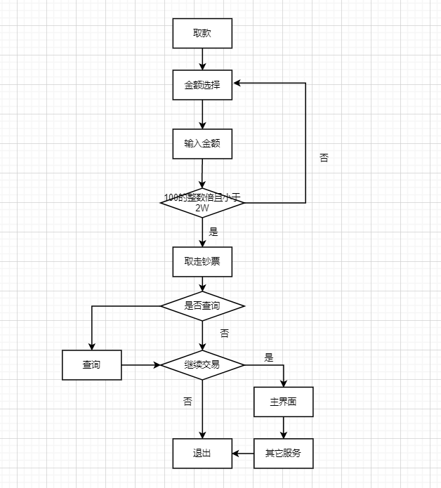
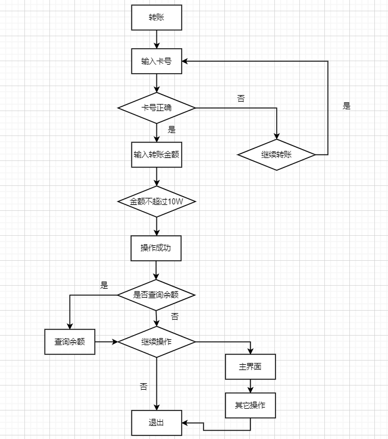
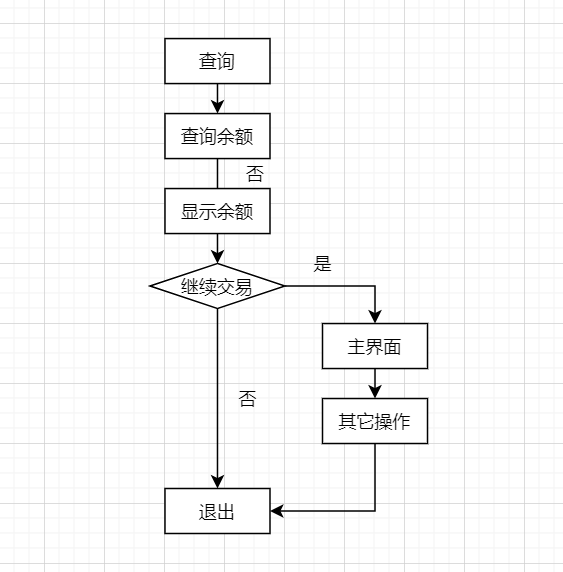

# 系统特性

## 功能需求

### 存取款

#### 存款
账号被识别后，可以进行存款操作

将人民币放入ATM机指定位置，确认无误后点击存款操作的按钮，等待存款结束，可以按返回按钮继续操作，不需则按退出按钮，结束操作

#### 取款
账号被识别后，可以进行取款操作

点击取款操作按钮，根据所需取款数额自行输入，但所输入的金额必须为100的整数倍，并且没人单次取款不能超过2W元

### 转帐/汇款
账号被识别后，可以进行转账操作

点击转账操作按钮，输入对方卡号，输入转账金额，确认无误后点击确认转账按钮。

转账的金额任意，但金额要少于10W元

### 查询
账号被识别后，可以进行查询操作

查询操作可以进入主页面后直接进行，也可以进行完其它操作后直接查询

